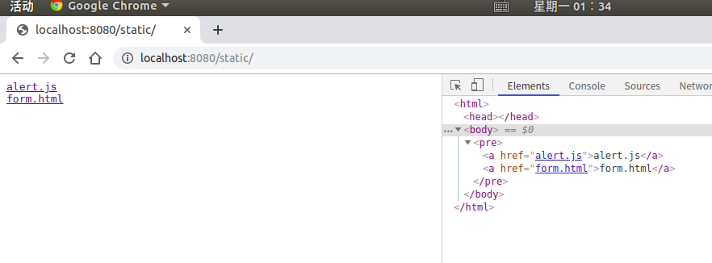
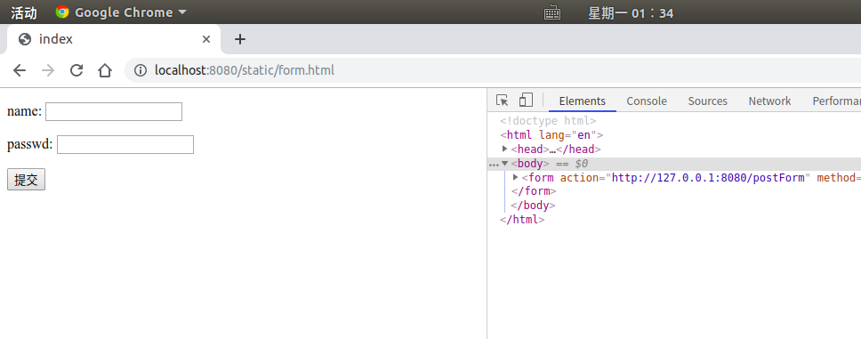
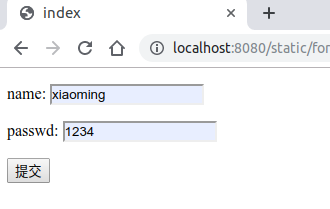
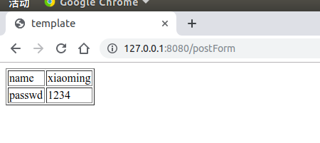
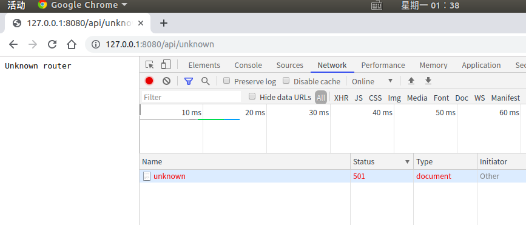

## 作业四

### 任务要求

处理 web 程序的输入与输出：设计一个 web 小应用，展示静态文件服务、js 请求支持、模板输出、表单处理、Filter 中间件设计等方面的能力。（不需要数据库支持）

#### 具体要求

1. 支持静态文件服务
2. 支持简单 js 访问
3. 提交表单，并输出一个表格
4. 对 `/unknown` 给出开发中的提示，返回码 `5xx`

## 结果

+ 支持静态文件服务

  

  

+ 支持简单 js 访问

  ```bash
  weltloose@Linux2:~/文档/大三上/服务计算/SCOC/hw4$ curl http://localhost:8080/a/testJs
  {"Info":"hello world"}weltloose@Linux2:~/文档/大三上/服务计算/SCOC/hw4$ 
  ```

+ 提交表单，并输出一个表格

  

  

+ 对 `/unknown` 给出开发中的提示，返回码 `5xx`

  