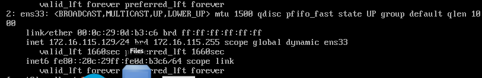
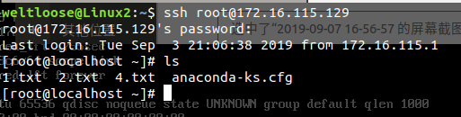
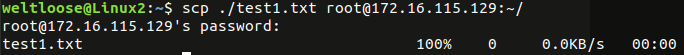
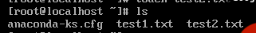

# 使用虚拟机实现云服务
## 实验环境
在Ubuntu19.04上使用VMware
## 1.安装VMware
参见链接https://www.jianshu.com/p/5fc43bbbac5a
## 2.创建linux虚拟机
这里使用的是Centos的 [Minimal ISO](http://isoredirect.centos.org/centos/7/isos/x86_64/CentOS-7-x86_64-Minimal-1810.iso)
## 3.配置虚拟机
* 创建虚拟机：内存分配1G,存储3G，网卡使用默认的NAT即可
* 安装完虚拟机后打开网络，配置国内源，安装必要程序
	1. 首先因为CentOS默认是关闭网络的，要先开启：
```
	sudo vi /etc/sysconfig/network-scripts/ifcfg-ens33    //这里最后的ifcfg-ens33根据自己的网卡名决定，在/etc/sysconfig/
```
		network-scripts中ls,看跟ifcfg-ens33差不多的就是了
		然后修改配置文件：
		ONBOOT=yes
		NM_CONTROLLED=no
		重启网络:
```
	sudo systemctl restart network
```
	2. 接着修改源
```
		wget -O /etc/yum.repos.d/CentOS-Base.repo http://mirrors.aliyun.com/repo/Centos-7.repo
		yum clean all
		yum makecache
```
- 配置ssh服务
	1. 安装ssh:
```
		sudo yum install openssh*
```
	2. 配置ssh:
```
		sudo vi /etc/ssh/sshd_config
```
		输入?PermitRootLogin找到那一行将它的注释取消掉，保存退出 //这里我只设置了允许用root权限登录,每次打个命令还要输密码真的烦
	3. 启动ssh:
```
		sudo systemctl restart sshd    //重新启动ssh服务
		sudo systemctl enable sshd   //设置ssh开机启动
```
	4. 打开防火墙的22端口：
```
		sudo firewall-cmd --add-service=ssh --permanent
		sudo  firewall-cmd --reload
```
## 4.验证效果
* 先在虚拟机中使用ip addr命令查看虚拟机的ip地址，我的是172.16.115.129

* 在主机上使用ssh登录虚拟机
```
	ssh root@172.16.115.129
```

* 使用scp将本地文件复制到虚拟机中：
```
	scp ./test1.txt root@172.16.115.129:~/    
```


* 使用scp将虚拟机文件复制到本地：
```
	scp root@172.16.115.129:~/test2.txt ~/test2.txt  输入密码
```
## 克隆虚拟机克隆
	将虚拟机关闭然后左上角VM->Manage->Clone..即可，vmware会自动为其配好网络信息
