# 实验三

## 代码逻辑：

命令行解析（使用pflag的shorthand处理-sInt,-eInt,-dInt,-dString,-lInt,-f）

```go
var start = flag.IntP("start", "s", -1, "the start page num to fetch.")
var end = flag.IntP("end", "e", -1, "the end page num to fetch.")
var lines = flag.IntP("lines", "l", 72, "fixed line number of a page.")
var dest = flag.StringP("dest", "d", "", "the dest printer num.")
var f_mark = flag.BoolP("f_mark", "f", false, "pages end at form-feed.")
```

并解析

```go
flag.Parse()
```

判断是否有输入文件，如果没有则使用标准输入，否则打开文件

```go
var to_read io.Reader = os.Stdin

if flag.NArg() == 1 {
    var err error
    to_read, err = os.OpenFile(flag.Arg(0), os.O_RDONLY, 0000)
    if err != nil {
        log.Fatal(err)
    }
}
```

判断是否有要求打印机，如果没有则设输出为标准输出，如果有则执行lp -d *dest命令，为子进程打开输入管道，并设输出为子进程的输入管道

```go
var to_write io.Writer = os.Stdout

if *dest != "" {
    cmd := exec.Command("lp", "-d", *dest)
    to_write, _ = cmd.StdinPipe()
    cmd.Start()
}
```

接着判断换页方式，命令行参数有设置-f则优先使用换页符，否则按行数算，默认72，通过函数做参数来达成,read_with_fmark判断是否换页符，read_with_lines判断是否换行符并且行数达到要求的换页行数

```go
// type read_decision func(int, byte) bool
var fc read_decision

if *f_mark {
    fc = read_with_fmark
} else {
    fc = read_with_lines
}
```

最后是一个read_pages函数，它接受一个输入，一个输出，以及一个判断函数read_decision

```go
func read_pages(f *os.File, fc read_decision, w io.Writer) 
```

关于read_pages函数的逻辑：

新建一个缓冲区，设置4个标志,ln(当前页的行数),pgs(页序号),s(缓冲区中要打印的内容的开始下标),e(缓冲区中要打印的内容的结束下标)每次从io.Reader中读入BUF_SIZE个字节到缓冲区中然后对缓冲区的字符逐个进行操作，具体看代码

```go
func read_pages(f io.Reader, fc read_decision, w io.Writer) {
	buf := make([]byte, BUF_SIZE)
	ln := 0
	pgs := 1
	s := -1
	if *start == 1 { // 如果是第一页需要额外判定
		s = 0
	}
	for n, _ := f.Read(buf); n > 0; n, _ = f.Read(buf) {
		if s >= 0 {      // 如果从之前的buf就开始打印了，那么这里要把它置为0
			s = 0
		}
		e := n           // 默认到buf读入的末尾，如果在buf中出现了终止的情况再修改e
		for i := 0; i < n; i++ {
			if buf[i] == '\n' {
				ln++
			}
			if fc(ln, buf[i]) {     // 判断是否换页
				ln = 0
				pgs++
				if pgs == *start {
					s = i + 1
				} else if pgs == *end+1 {
					if i == 0 {
						return // 如果它是在下一个buf的第一个字节，则说明该有的已经全都打印了
					}
					e = i + 1
				}

			}

		}
		if s != -1 {
			w.Write(buf[s:e])
		}
		if e != n {
			return
		}

	}
}
```

## 测试

用脚本创建一个1000行的文件

```python
>>> fs = open("test.txt", 'w')
>>> for i in range(1000):
...     fs.write(str(i) + "\n")
... 
>>> fs.close()
```

命令行执行

+ 测试一

```shell
./m_selpg -s1 -e1 test.txt
```

​	结果输出72行，正确

​	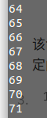

+ 测试二

  ```shell
  ./m_selpg -s1 -e1 < test.txt
  ```

  结果与上面一样

+ 测试三

  ```shell
  cat test.txt | ./m_selpg -s10 -e20
  ```

  结果输出从648到999，因为总共只有1000行，正确

  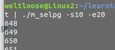

  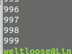

+ 测试四

  ```shell
  ./m_selpg -s10 -e20 test.txt >output_file
  ```

  结果，命令没输出，执行cat test.txt与上面一样

  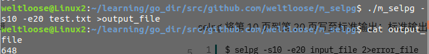

  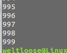

+ 测试五

  ```shell
  ./m_selpg -s10 -e20 test.txt 2>error_file
  ```

  结果，输出与三一样

  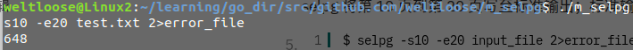

+ 测试六

  ```shell
  ./m_selpg -s10 -e20 test.txt >output_file  2>error_file
  ```

  结果与4一样，因为没有错误产生

+ 测试七

  ```shell
  ./m_selpg -s10 -e20 test.txt >output_file 2>/dev/null
  ```

  结果与4一样

+ 测试八

  ```shell
  ./m_selpg -s10 -e20 test.txt >/dev/null
  ```

  结果完全没有输出

+ 测试九

  ```shell
  ./m_selpg -s10 -e20 test.txt | wc
  ```

  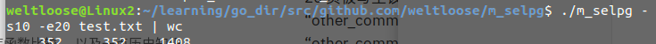

+ 测试十

  ```shell
  ./m_selpg -s10 -e20 test.txt 2>error_file | wc
  ```

  结果与九一样因为没有错误产生

+ 测试十一

  ```shell
  ./m_selpg -s10 -e20 -l66 test.txt
  ```

  结果输出从594到999，因为总共只有1000行，所以只能到999，正确

  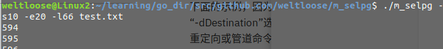

  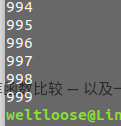

+ 测试十二

  为了出现换页符，制造一个新文件

  ```shell
  ./m_selpg -s10 -e20 -l10 test.txt > test1.txt;
  echo -e "\f" >> test1.txt;
  ./m_selpg -s1 -e2 -l10 test.txt >> test1.txt;
  echo -e "\f" >> test1.txt;
  ./m_selpg -s1 -e2 -l15 test.txt >> test1.txt;
  echo -e "\f" >> test1.txt
  ```

  测试

  ```shell
  ./m_selpg -s1 -e2 -f test1.txt
  ```

  结果输出90-199,0-19，正确

  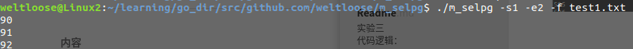

  

  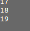

+ 测试十三

  为了有打印设备，安装了虚拟打印机

  ```
  sudo apt-get install cups-pdf
  ```

  执行

  ```shell
  ./m_selpg -s1 -e2 -dPDF -f test1.txt
  ```

  生成pdf正确

  

+ 测试十四

  ```shell
  ./m_selpg -s10 -e20 test.txt > output_file 2>error_file &
  ```

  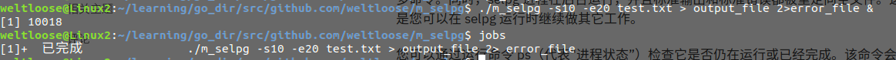

