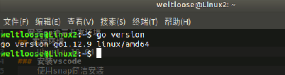
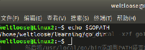
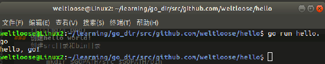
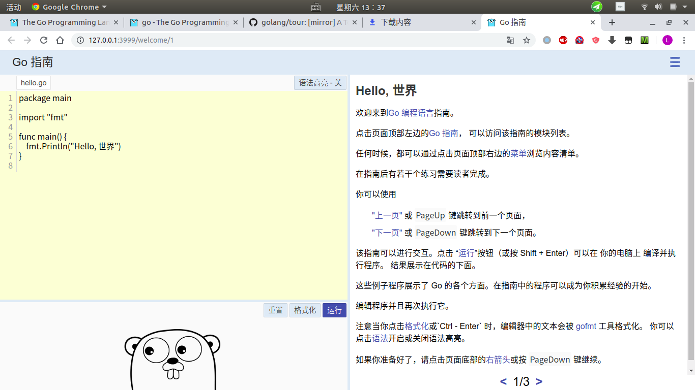
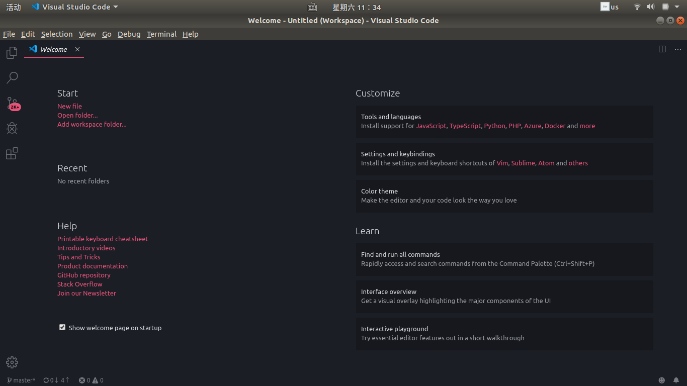
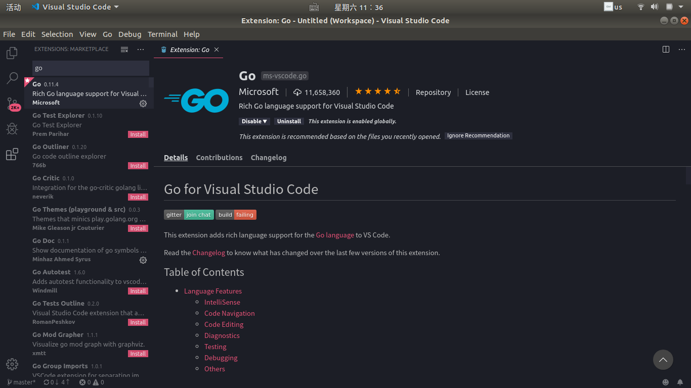
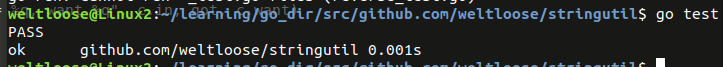

# 安装go语言开发环境
## 实验环境
Ubuntu 19.04 
### 安装golang
由于go安装包需要在官网上下载（已被墙），我将安装包放在了这里(链接: https://pan.baidu.com/s/18aRSEnX_exuuHzZy9mdJ5A 提取码: j4ik )
下载此压缩包并提取到/usr/local目录
```
	sudo tar -C /usr/local -xzf go1.12.9.linux-amd64.tar.gz
```
然后将/usr/local/go/bin添加到PATH境变量中，将此行添加到$HOME/.profile中：
```
	export PATH=$PATH:/usr/local/go/bin
```
测试
重启电脑，或者执行
```
	source ~/.bashrc 
```
然后输入
```
go version
```

### 设置GO环境变量
创建go工作空间
```
	mkdir $HOME/learning/go_dir
```
配置环境,在~/.profile中添加
```
	export GOPATH=$HOME/learning/go_dir
```
重启电脑，或者执行
```
	source ~/.bashrc
```
检查配置
```
	echo $GOPATH
```

### 创建hello world!
创建src目录和bin目录
```
	mkdir $GOPATH/src $GOPATH/bin
```
创建新项目
```
	mkdir $GOPATH/src/github.com/weltloose/hello -p
```
在vscode中打开go workplace，创建hello.go
```
package main
import "fmt"
func main(){
	fmt.Printf("hello, go\n")
}
```
终端运行
```
go run hello.go
```

### 安装gotour
首先安装hg(使用https协议而不是git协议下载代码包)
```
	sudo apt-get install mercurial
```
hg获取代码包并安装必要go包
```
	cd $GOPATH/src
	mkdir bitbucket.org/mikespook -p
	cd bitbucket.org/mikespook
	hg clone https://bitbucket.org/mikespook/go-tour-zh
	cd $GOPAHT/src
	mkdir golang.org/x -p
	cd golang.org/x
	git clone https://github.com/golang/tools
	git clone https://github.com/golang/net
	cd $GOPATH/src/bitbucket.org/mikespook/go-tour-zh//gotour
	go build
```
执行
```
	$GOPATH/bin/gotour
```
打开网页http://127.0.0.1:3999

### 安装vscode
使用snap简洁安装
```
	sudo apt install snapd
	sudo snap install --classic vscode
``` 
效果

安装对应插件 Go

效果

### 使用go写第一个包，做第一次测试
```
mkdir $GOPATH/src/github.com/weltloose/stringutil
cd $GOPATH/src/github.com/weltloose/stringutil
cat > reverse.go
package stringutil

func Reverse(s string) string{
        r := []rune(s)
        for i,j := 0, len(r) - 1; i < len(r) / 2; i, j = i + 1, j - 1{
                r[i], r[j] = r[j], r[i]
        }
        return string(r)
}
EOF
```
测试：
```
cat > reverse_test.go
package stringutil

import "testing"

func TestReverse(t *testing.T){
        cases := []struct {
                in, want string
        }{
                {"Hello, world", "dlrow ,olleH"},
                {"Hello, 世界", "界世 ,olleH"},
                {"", ""},
        }
        for _,c := range cases {
                got := Reverse(c.in)
                if got != c.want{
                        t.Errorf("Reverse(%q) == %q, want %q", c.in, got, c.want)
                }
        }
}
EOF
```
执行
```
go test
```
